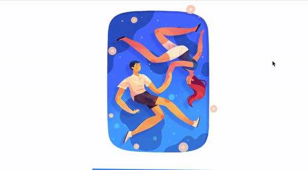

# Interactive Parallax Art

Gyro based or mouse movement art, on a stacked layered png. Layers moved based on accelerometer reading.

## Screenshot

## Getting Started

see live demo [here](https://parallax-art.netlify.com/)

### Prerequisites

localhost, using live server or any other local hosting services

### Installing

1. Draw something in layers, mainly 8 layers, usually consist of
   1. background layer
   2. mid layer
   3. subject layer
2. Replace the picture layer in image folder
3. Replace the `layer_list` dictionaries as needed

## Built With

JavaScript

## Acknowledgments

* **Jarom Vogel** - *Canvas, gyro work, art* - [web](https://jaromvogel.com/)
